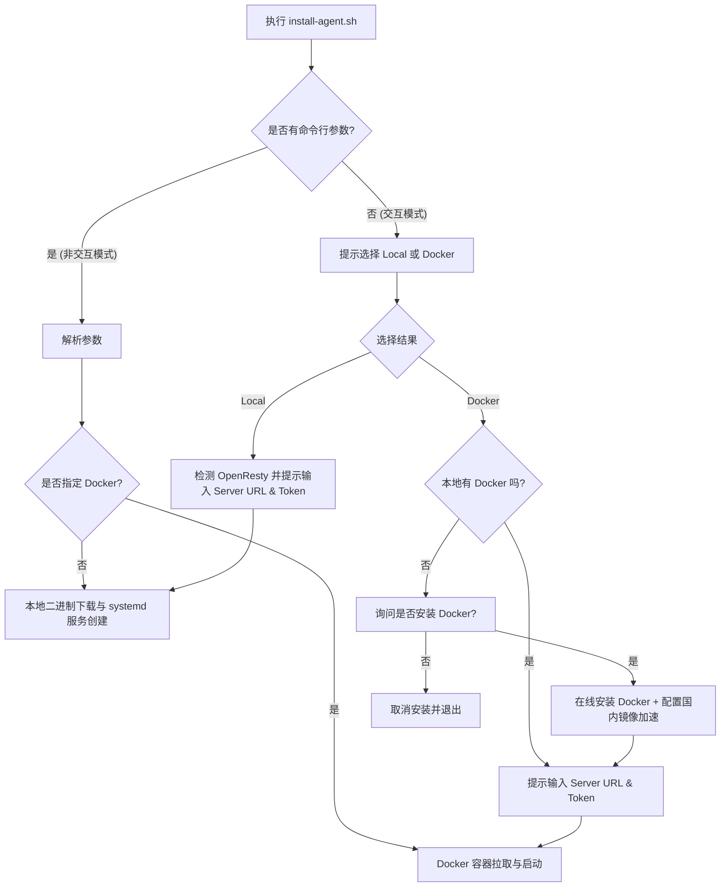

# 交互式智能安装脚本实现计划

本计划旨在拓展 OpenFlare Agent 安装脚本的功能，支持交互式选择本地安装或 Docker 容器安装，并提供智能检测/在线安装 Docker 环境的机制，同时保留通过命令行传参进行自动化安装的既有能力。

---

## 1. 目标与背景 (Goal & Context)
* **需求背景**：当前安装脚本 `install-agent.sh` 仅支持在宿主机直接下载二进制并配置为本地 systemd 服务运行。随着 Docker 部署方式的普及，需要让用户在一键安装时能根据需要交互式选择 Docker 或本地部署，从而提升部署体验。
* **开发范围 (Scope)**：
  * 支持交互式运行（未传参时）：提示用户选择 Local 方式或 Docker 方式。
  * 当选择 Docker 方式时，检测本地是否存在 `docker` 命令。若不存在，提示并在线安装 Docker（支持国内镜像源及自动测速选择最低延迟源）。
  * 交互引导用户配置 `server_url` 和 `agent-token` 或 `discovery-token`。
  * 如果选择 Docker，则最终拉取 Agent 镜像并运行容器；如果选择 Local，则继续原有的本地二进制下载及配置发布逻辑。
  * 兼容非交互式模式：如果执行脚本时传递了任意参数，则跳过任何交互式提示，直接进行自动化安装（支持新参数 `--docker` / `--method docker` 来自动选用 Docker 部署）。

---

## 2. 设计与决策 (Design & Decisions)

### 交互工作流
1. 检查 `$#`（参数数量）。若 `$# -eq 0`，激活 `INTERACTIVE=true`。
2. 在交互模式下：
   * 引导用户选择安装方法（1: Local, 2: Docker）。
   * 若选择 Docker，调用 `Install_Docker` 检测并安装环境。
   * 引导用户输入 `SERVER_URL` 并进行非空校验。
   * 引导用户选择 Token 类型（1: Discovery Token, 2: Agent Token），并输入对应的 Token 值。
   * 若选择 Local 且未传 `--openresty-path`，如果 `openresty` 二进制未能在 $PATH 中找到，交互提示用户手动输入 OpenResty 路径。
3. 非交互模式下：
   * 解析命令行参数。
   * 支持通过 `--docker` 或 `--method docker` 指定 Docker 容器安装。
   * 依然根据传入的 `--server-url` 和 Token 自动执行安装，绝不进行任何交互。

### 数据流与架构图

---

## 3. 具体修改文件清单 (Proposed Changes)

### 边缘 Agent 与部署脚本
* #### [MODIFY] [install-agent.sh](file:///Users/ryan/DEV/Go/OpenFlare/scripts/install-agent.sh)
  * 职责：
    1. 引入交互式选择逻辑和 `Install_Docker` / `configure_accelerator` 函数。
    2. 新增 `--docker` 和 `--method` 命令行参数支持。
    3. 支持用户交互输入配置项。
    4. 增加 Docker 镜像拉取、停止旧容器并启动新容器的安装路径。
* #### [MODIFY] [agent.md](file:///Users/ryan/DEV/Go/OpenFlare/docs/deployment/agent.md)
  * 职责：更新一键安装说明文档，增加交互式模式的说明以及 `--docker` 参数的自动化 Docker 安装说明。

---

## 4. 验证计划 (Verification Plan)

### 自动化与脚本测试
* 在干净的测试环境运行脚本：
  * `bash scripts/install-agent.sh` （测试交互模式 -> 选用 Local）
  * `bash scripts/install-agent.sh` （测试交互模式 -> 选用 Docker）
  * `bash scripts/install-agent.sh --server-url http://127.0.0.1:3000 --discovery-token mytoken` （测试自动 Local 安装）
  * `bash scripts/install-agent.sh --server-url http://127.0.0.1:3000 --discovery-token mytoken --docker` （测试自动 Docker 安装）

### 数据面生效验证
* 通过 `docker ps` 和 `docker logs openflare-agent` 确认容器成功拉取并启动，环境参数注入正确。
